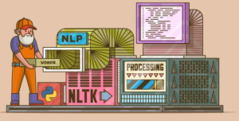
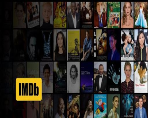

# Procesamiento del Lenguaje Natural
Universidada de Buenos Aires - FIUBA- Especialización en Inteligencia Artificial

## Challenge 1
 \
Hands on NLP basics with Python

- vectorization
- frequence vector
- one-hot encoding

Colab: [desafio_1_word2vec](https://github.com/mluzu/nlp/blob/main/desafio_1_word2vec.ipynb)

## Challenge 2
 \
A minimal rules-based bot from a Wikipedia article

- Embeddings
- text preprocessing
- rules-based bot

Colab: [desafio_2_bot](https://github.com/mluzu/nlp/blob/main/desafio_2_bot.ipynb)

## Challenge 3
 \
Playing with vectors from IMDB reviews

- Word2Vec
- Glove a and Fasttext Embeddings
- Skip-gram
- CBOW
- Gensim

Colab: [desafio_3_gensim](https://github.com/mluzu/nlp/blob/main/desafio_3_gensim.ipynb)

## Challenge 4
 \
Movies charactes lines prediction with LSTM 

- RNN
- LSTM
- text prediction

Colab: [desafio_4_rnn](https://github.com/mluzu/nlp/blob/main/desafio_4_rnn.ipynb)

## Challenge 5
 \
Sentiment Analysis with clothes reviews

- Sentiment Analysis

Colab: [desafio_5_clothing_reviews](https://github.com/mluzu/nlp/blob/main/desafio_5_clothing_reviews.ipynb)

## Challenge 6
 \
QA bot

 - sequence to sequence models
 - translators
 - chat bots

Colab: [desafio_6_bot_qa](https://github.com/mluzu/nlp/blob/main/desafio_6_bot_qa.ipynb)

